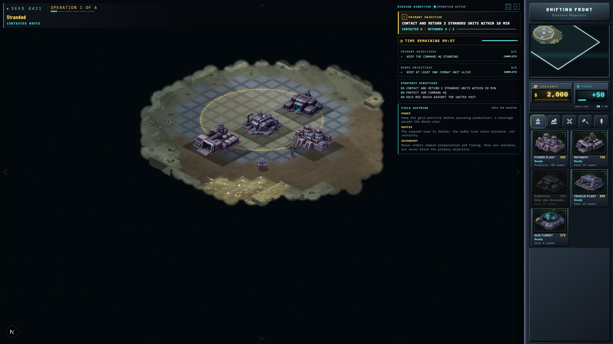

# Shifting Front

> A seeded isometric RTS — one 4-digit code writes the war.

[Play now](https://shiftingfront.com) · [Run locally](#run-locally) · [View source](https://github.com/zakaihamilton/shiftingfront)

Shifting Front is a browser-based real-time strategy game about building a force, reading the ground, and surviving the next push. Enter a 4-digit campaign code and the game writes a complete theater around it: factions, commanders, conflict, story, maps, and objectives.

The same code always creates the same campaign. Share a code to share a universe, return to a saved theater without an account, or start a new war with the roll of a button.



## Why play

- **Every code is a theater.** Each seed creates its own world, rival factions, named characters, briefings, six-operation campaign, and changing battlefield.
- **The objective keeps moving.** Build an economy, train combined-arms forces, destroy enemy positions, hold your HQ, or escort, rescue, sabotage, and extract under pressure.
- **The ground is part of the fight.** Each campaign targets one seeded biome, such as ash plains, crystal flats, rust canyons, or the volcanic shelf. Choose routes, protect resource lines, and make every approach count as the operation grows.
- **Your army has more than one job.** Field Medics keep infantry alive, Repair Trucks keep vehicles moving, Harvesters fund the war, and Convoy Trucks become the mission when the objective changes.
- **The enemy reacts.** Rival forces expand, fortify, raid your harvesters, pressure your lines, and retreat when battered. A plan that works once may not survive the next theater.

## How a campaign works

1. **Choose a code.** Enter any seed from `0000` to `9999`, roll a random campaign, or join the synchronized weekly operation.
2. **Read the briefing.** Meet your commander, advisor, and enemy leader, then study the operation and its secondary objectives.
3. **Build your foothold.** Harvest ore, manage credits and power, place infrastructure, and open production lines.
4. **Command the battle.** Move, attack, defend, repair, support, and reposition your force as the enemy and terrain reveal themselves.
5. **Earn the record.** Complete the operation, improve your score and medals, unlock the next deployment, or replay the theater with a better plan.

Every campaign contains six operations: three classic objectives and three scenario operations. Missions grow from compact early engagements into larger late-campaign battlefields, with typical play sessions ranging from a few minutes to longer timed operations.

## The mission board

| Mission style | The job |
| --- | --- |
| Build the advantage | Harvest resources, train a force, or construct the required infrastructure. |
| Break the enemy | Destroy marked positions, raze the base, decapitate enemy command, or annihilate the opposing force. |
| Hold under pressure | Keep your Command HQ standing while the clock and enemy attacks close in. |
| Run the operation | Escort a convoy, sabotage marked structures, rescue stranded units, or extract cargo before time runs out. |

Every mission also carries secondary objectives, such as protecting your Construction Yard, keeping combat units alive, or finishing before the final push. Lose your Command HQ and the theater is lost.

## Command the front

The core loop is simple to learn and difficult to master:

```text
harvest ore → manage credits and power → build → train → maneuver → fight
```

Use Barracks for Infantry, Anti-armor units, and Field Medics. Use a Vehicle Plant for Harvesters, Tanks, Repair Trucks, and mission Convoy Trucks. Repair damaged buildings, scrap what you no longer need, choose a stance and formation, and use the minimap to keep the whole front in view.

The battlefield supports mouse, keyboard, and touch play. The HUD shows the complete shortcut list in-game; these are the essentials:

| Input | Action |
| --- | --- |
| Left click / drag | Select units and buildings. |
| Right click | Move while firing at enemies on the way; attack enemy targets, harvest ore, or assign support. |
| Ctrl / Cmd + right click | Explicit attack-move order with the same attack-and-continue behavior. |
| WASD / arrow keys | Pan the camera. |
| `R` / `F` / `X` | Repair, scrap, or stop selected units. |
| `Space` / `Esc` | Center on the selection, or pause and cancel. |
| Touch under 800px | Use the mobile command tray. |

## Start playing

[**Launch Shifting Front at shiftingfront.com →**](https://shiftingfront.com)

No account is required. Campaign progress, named save slots, audio settings, scores, and medals are stored in the browser on your device.

## Run locally

Shifting Front is an open-source browser game. To run it from source, you need [Node.js](https://nodejs.org/) `22.22.2` or newer and [Yarn 1](https://classic.yarnpkg.com/).

```bash
yarn install --frozen-lockfile
yarn dev
```

Open [http://localhost:3000](http://localhost:3000), choose **New Game**, enter a 4-digit code, and launch the briefing. Use **Tutorial** for a guided training range with no time limit.

### Useful commands

| Command | Purpose |
| --- | --- |
| `yarn dev` | Start the development server. |
| `yarn build && yarn start` | Build and serve the production app. |
| `yarn test` | Run the full Vitest suite. |
| `yarn verify:fast` | Recommended local pre-push check: type checking, linting, and the fast test tier. |
| `yarn test:e2e` | Run the Playwright browser smoke tests. |
| `yarn inspect 0421` | Inspect a generated campaign as JSON. |
| `yarn sim --seed 0421 --mission 0 --ticks 200` | Run a mission through the headless simulation. |

See [`package.json`](package.json) for the complete script catalog, including health, balance, performance, and asset tooling.

For browser tests, install the required Playwright browsers once with `yarn playwright install chromium webkit`.

## For contributors

The project is built with Next.js 16, React 19, TypeScript, and a Canvas 2D isometric renderer. Campaign generation and gameplay simulation live in DOM-free modules, so the browser, tests, and headless tools exercise the same deterministic game logic.

- `app/` contains the menu, briefing, campaign, tutorial, and play routes.
- `components/` contains the HUD, Canvas shell, menus, briefings, and Asset Bay.
- `lib/gen/` creates worlds, factions, characters, maps, stories, objectives, and visual specs from a seed.
- `lib/sim/` runs economy, production, movement, combat, support, repair, AI, and objectives.
- `public/art/` contains the game’s visual assets.

Read the [architecture guide](docs/architecture.md) before extending the runtime. The public Asset Bay is available at [`/assets`](https://shiftingfront.com/assets), with JSON asset routes under `/api/assets` for tools and experiments.

The core headless surface is intentionally small:

```ts
createCampaign(seed)
createMission({ seed, missionIndex })
tick(state, commands?)
issue(state, command)
inspect(state)
```

For deterministic bug reports and regression fixtures, the replay helpers in `lib/sim/replay.ts` run scheduled orders without a DOM.

## Project links

- [Play the game](https://shiftingfront.com)
- [GitHub repository](https://github.com/zakaihamilton/shiftingfront)
- [Architecture guide](docs/architecture.md)
- [Asset Bay](https://shiftingfront.com/assets)
